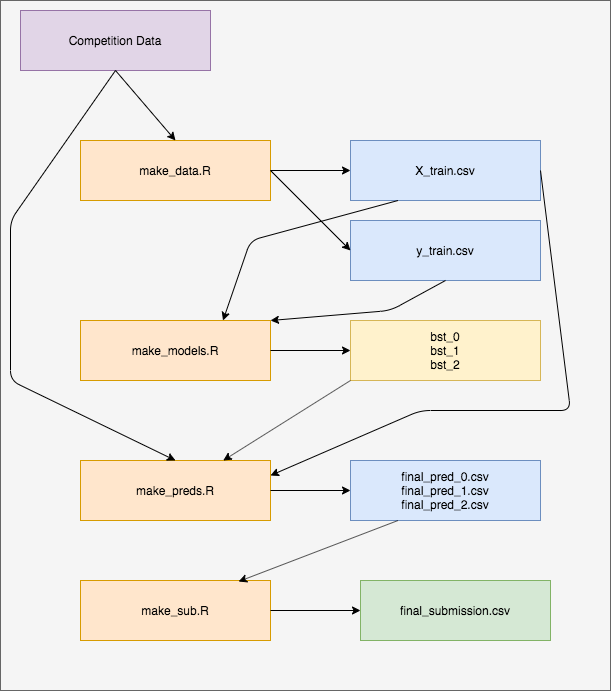

See my [Kaggle Discussion](https://www.kaggle.com/c/m5-forecasting-accuracy/discussion/163092) post which provides some more technical insights into my methodology. 

### M5 Forecasting - Accuracy Solution
  
This is a top 4% (221st of 5500) solution to the [M5 Forecasting competition](https://www.kaggle.com/c/m5-forecasting-accuracy) hosted by kaggle.  
  
The purpose of the competition is to forecast unit sales for 30490 items, 28 days into the future. Hence, we are making 30490 * 28 = 853720 predictions.  
  
### Solution Outline

The solution is written purely in R and leverages the data.table and LightGBM packages. The model building process uses 21 predictor variables to forecast one day into the future.  

Three models are created. All models use a random sample of the training data as validation data - otherwise, the model buidling process is identical.  
  
Recursive models are used, that is, we use Day 1 predictions as part of our feature engineering to then forecast Day 2, and so forth.  
 

### Software Design



### Running the Solution
First make sure that the competition data is in the ./data/ directory. The neccessary files are:  

* sales\_train_evaluation.csv  
* calendar.csv  
* sample_submission.csv  
  
Navigate to the ./scripts/ directory and run the following commands:  

```
Rscript make_data.R  
Rscript make_models.R 
Rscript make_preds.R
Rscript make_sub.R  
```
As the scripts are being executed, files will be saved into the ./scripts/cache/.  
  
As is, the execution will take hours. To greatly shorten execution time, see the following in make_data.R:  
  
```
i_train_values =  c(seq(0, 1600, 3)) # c(seq(0, 1600, 100))
```
  
Using the commented code will reduce execution time to less than 10 minutes (however, public score reduces from .59 to .78). This change simply reduces the amount of training data that is created and used.